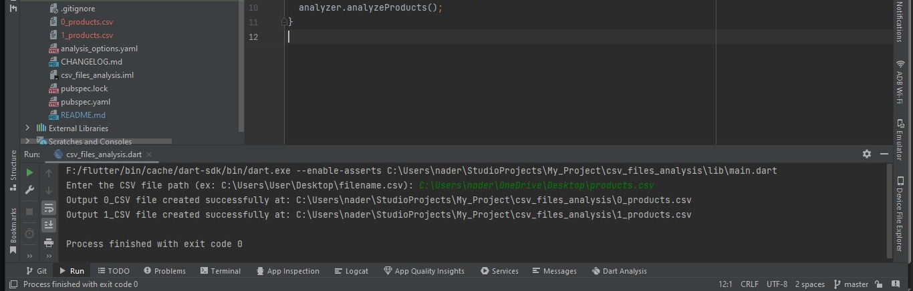
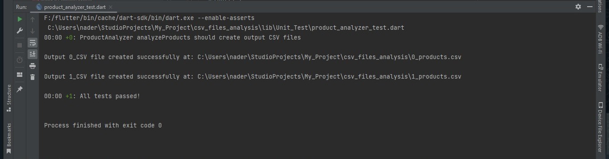

# CSV Files Analysis

- A Console program implemented with Dart, it takes a CSV File with a record of n order details.
- The program analysis CSV File and each record and create two CSV files named 0_input_file_name and 1_input_file_name.
- First file contain Product Name and the average quantity of the product purchased per order.
- Second one contain Product Name and the most popular Brand for that product ( Most popular is defined as the brand
  with the most total orders for the item ).

## CSV File Example

I have manually created a CSV File to test project and complete coding process, feel free to use it, Or you can use any other CSV file as mentioned in the task description.

- Download the example file [Download](https://drive.google.com/file/d/1aw3uEvZamekve08Ge5e3HTKwpXkOXg5O/view?usp=sharing)

## ScreenShot of final Created Tow Files

<table>
    <tr>
        <td></td>
    </tr>
</table>

## Unit Test

  unit tests for the ProductAnalyzer class that handle: 

- Receive CSV File Path from user through Console
- Extract and Parse CSV File Data 
- Calculate Average Quantity of Product in each record to generate first file
- Find Most Popular Brand in each record to generate second file

  * note : when applying unit test on your CSV File, don't forget to change variables of (Local File Path and Project Directory)
    const sampleCsvPath = 'C:\\Users\\nader\\OneDrive\\Desktop\\products.csv';
    const outputDirectory = 'C:\\Users\\nader\\StudioProjects\\My_Project\\csv_files_analysis';

## ScreenShot of Unit Test Result

<table>
    <tr>
        <td></td>
    </tr>
</table>

